# 架构设计文档

## 设计理念

AI-Native Godot 的核心设计理念是**让 AI 成为 Godot 的一等公民**。这意味着：

1. **安全性优先** — AI 操作决不能导致编辑器崩溃或数据丢失
2. **异步非阻塞** — AI 请求不应干扰用户手动操作
3. **实时感知** — AI 需要了解编辑器的实时状态变化
4. **增量高效** — 最小化通信开销，避免传输冗余数据
5. **原子事务** — 复合操作要么全部成功，要么全部回滚

## 整体架构

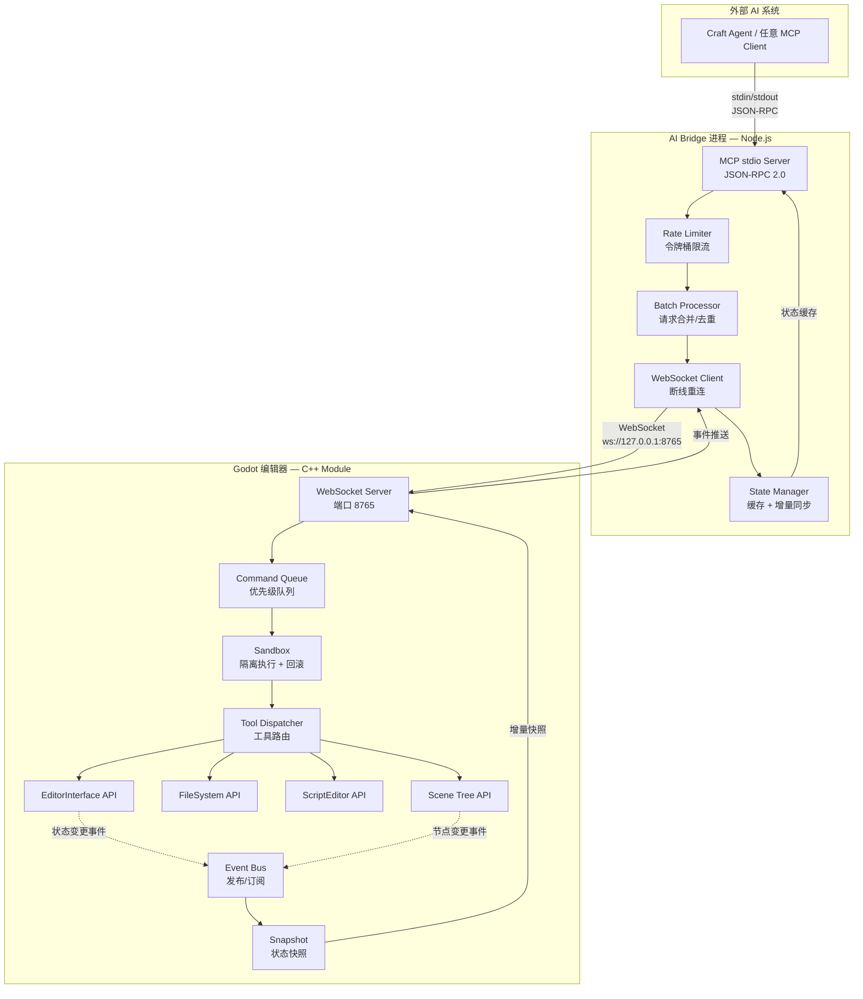

## 六大核心组件

### 1. MCPCommandQueue — 命令队列

命令队列是 AI 请求进入编辑器的唯一入口，负责请求的调度与流控。

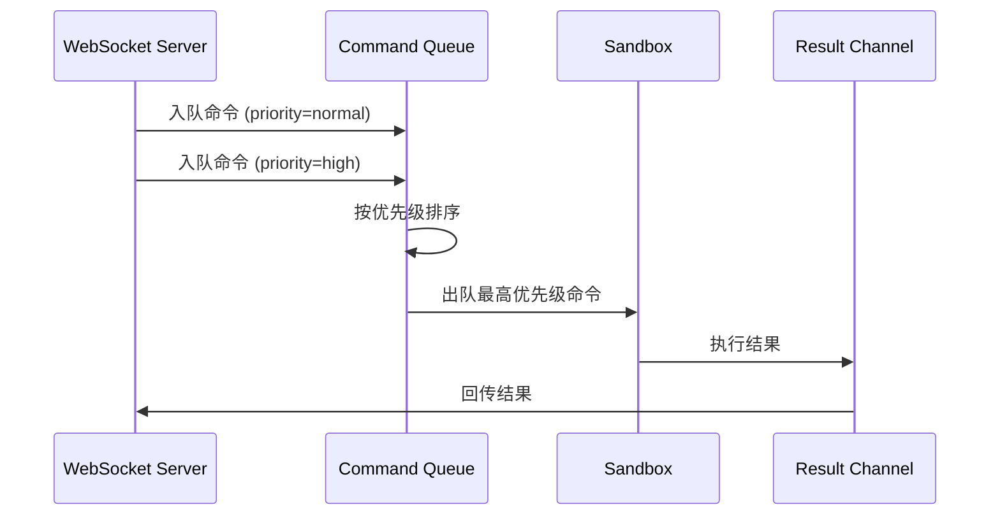

**设计要点：**

| 特性 | 说明 |
|------|------|
| 优先级队列 | `high`（紧急操作）、`normal`（常规操作）、`low`（批量查询） |
| 并发控制 | 最多 N 个并行沙箱（可配置，默认 3） |
| 超时管理 | 每个命令有执行超时（默认 5s），超时自动取消 |
| 原子标识 | 同一原子组内的命令要么全部执行，要么全部回滚 |

**命令生命周期：**

```
QUEUED → DISPATCHED → EXECUTING → COMPLETED
                   └→ TIMEOUT → ROLLED_BACK
                   └→ ERROR → ROLLED_BACK
```

### 2. MCPSandbox — 沙箱隔离

沙箱是安全性的核心保障，每个命令在独立上下文中执行。

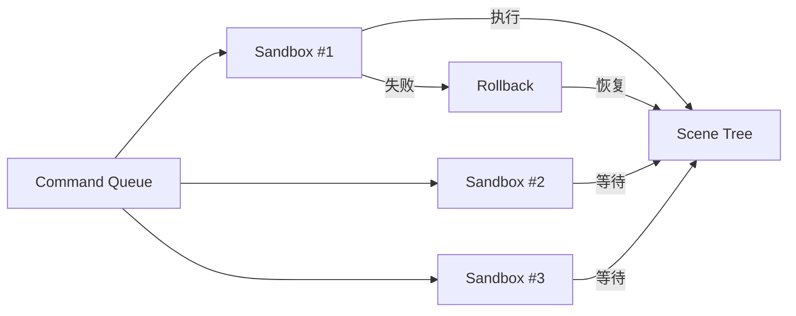

**隔离机制：**

- **快照隔离**：执行前对目标节点/资源创建快照
- **操作日志**：记录所有变更操作（create/modify/delete）
- **自动回滚**：执行失败时按逆序恢复快照
- **资源限制**：限制单次命令的最大内存/CPU 消耗

**回滚策略：**

| 操作类型 | 回滚方式 |
|---------|---------|
| 节点创建 | 删除创建的节点 |
| 属性修改 | 恢复快照中的原始值 |
| 节点删除 | 从快照重建节点（含子树） |
| 脚本编辑 | 恢复脚本快照 |
| 文件操作 | 从备份恢复文件 |

### 3. MCPEventBus — 事件总线

事件总线实现了编辑器到 AI 的实时通知，替代了原版的轮询模式。

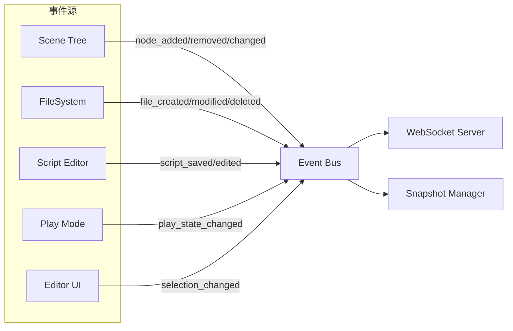

**事件类型：**

| 类别 | 事件 | 说明 |
|------|------|------|
| 场景 | `scene.opened` / `scene.closed` / `scene.saved` | 场景生命周期 |
| 节点 | `node.added` / `node.removed` / `node.property_changed` | 节点变更 |
| 选择 | `selection.changed` | 编辑器选中变化 |
| 脚本 | `script.saved` / `script.error_detected` | 脚本相关 |
| 播放 | `play_mode.entered` / `play_mode.exited` | 播放模式切换 |
| 文件 | `file.created` / `file.modified` / `file.deleted` | 文件系统变更 |

**订阅机制：**

AI Bridge 可通过 `subscribe` 命令选择性订阅事件类型，减少不必要的通知。

### 4. MCPWebSocketServer — 通信层

WebSocket 通信层替代了原版的 HTTP 轮询，实现了真正的双向实时通信。

**协议设计：**

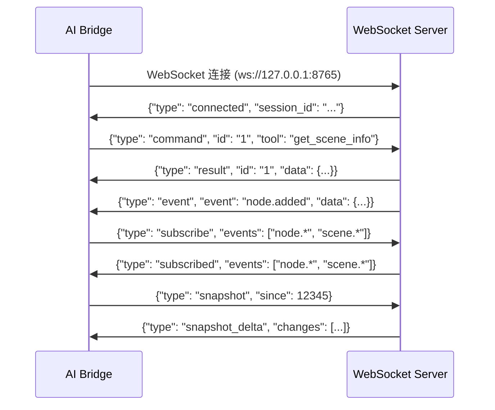

**帧格式：**

```json
{
  "type": "command | result | event | subscribe | snapshot | error",
  "id": "unique-request-id",
  "tool": "tool_name",
  "arguments": {},
  "data": {},
  "timestamp": 1234567890
}
```

**连接管理：**

| 特性 | 说明 |
|------|------|
| 多客户端 | 支持最多 5 个 WebSocket 客户端同时连接 |
| 心跳检测 | 每 30s 发送 ping，超时 60s 断开 |
| 断线重连 | AI Bridge 自动重连（指数退避） |
| 消息缓冲 | 断线期间事件缓冲，重连后补发 |

### 5. MCPSnapshot — 状态快照

状态快照系统实现了增量同步，避免每次请求都传输完整状态。

**快照内容：**

```json
{
  "version": 42,
  "timestamp": 1234567890,
  "scene_tree": { "root": {...}, "deleted": ["..."] },
  "open_scenes": ["res://main.tscn"],
  "selection": ["Node3D/Camera3D"],
  "play_state": "stopped",
  "modified_properties": {
    "Node3D:position": {"x": 1.0, "y": 2.0, "z": 3.0}
  }
}
```

**增量同步流程：**

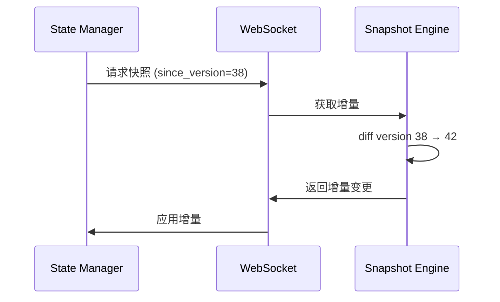

| 特性 | 说明 |
|------|------|
| 版本号 | 递增版本号，每次变更 +1 |
| 增量计算 | 只传输版本间的差异 |
| 压缩 | 超过 1KB 的增量自动 gzip 压缩 |
| 周期快照 | 每 1s 自动生成完整快照的增量 |

### 6. ToolDispatcher — 工具分派

工具分派器根据工具名称路由到对应的 C++ 实现函数，替代原版的 GDScript Callable 调度。

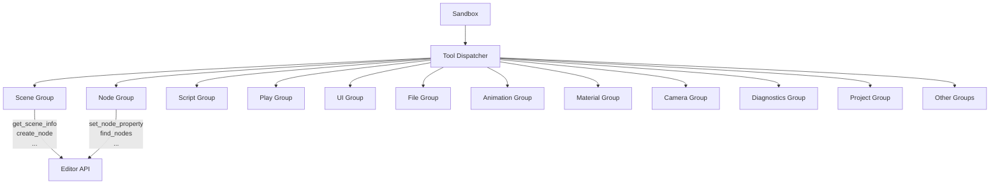

**分派机制：**

1. 工具名和 Handler 在模块初始化时注册到分发表
2. 每个工具对应一个 C++ 静态函数
3. 函数签名统一为 `Dictionary execute(const Dictionary &arguments)`
4. 参数校验在分派前完成
5. 执行结果统一为 JSON 序列化的 Dictionary

**与原版的性能对比：**

| 指标 | GDScript Callable | C++ Function Pointer |
|------|-------------------|---------------------|
| 单次调度开销 | ~0.5ms | ~0.01ms |
| 参数序列化 | GDScript → JSON 双重转换 | 直接 Dictionary |
| GC 压力 | 每次调用产生 Variant 对象 | 零 GC |
| 类型安全 | 运行时检查 | 编译时检查 |

## 数据流

### 完整请求-响应流

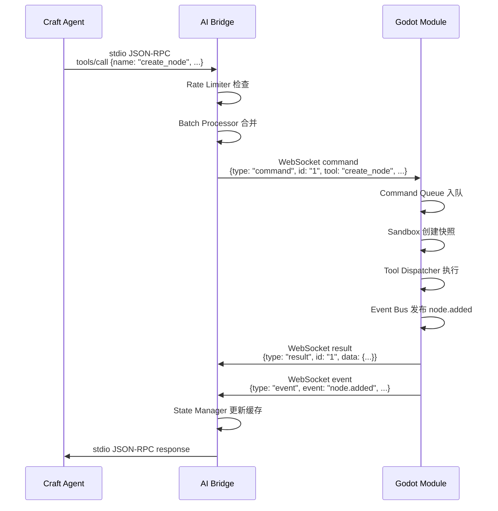

### 事件推送流

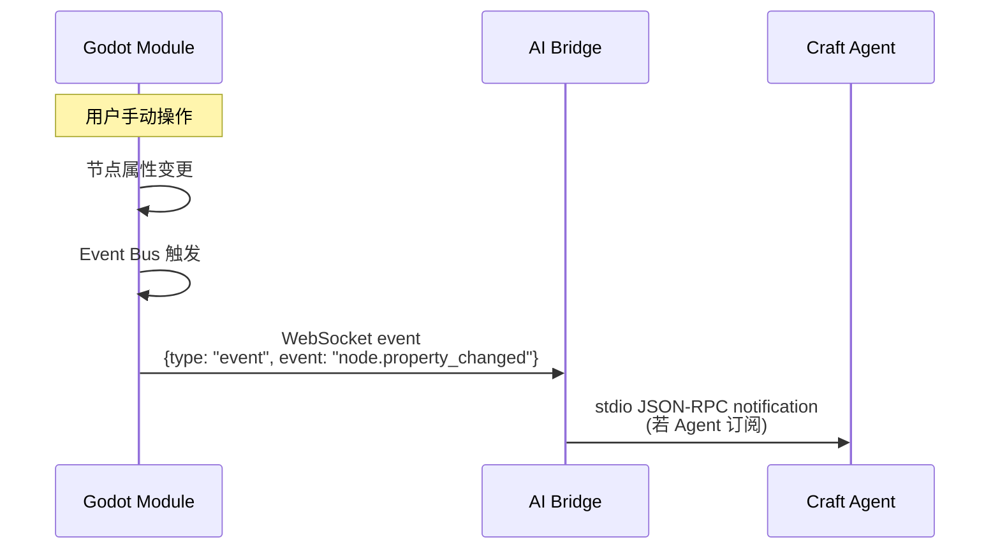

## 错误处理策略

### 分层错误处理

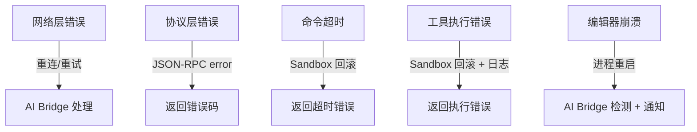

**错误码规范：**

| 错误码 | 范围 | 说明 |
|--------|------|------|
| `-32700` | 协议 | JSON 解析错误 |
| `-32600` | 协议 | 无效请求 |
| `-32601` | 协议 | 方法未找到 |
| `-32602` | 协议 | 无效参数 |
| `-32603` | 协议 | 内部错误 |
| `-32001` | 运行时 | 命令超时 |
| `-32002` | 运行时 | 沙箱回滚 |
| `-32003` | 运行时 | 限流拒绝 |
| `-32004` | 运行时 | 编辑器未就绪 |
| `-32005` | 运行时 | 工具执行失败 |

### 回滚保证

1. **快照优先**：每个变更操作执行前创建快照
2. **逆序恢复**：回滚时按操作逆序恢复
3. **级联回滚**：原子组中任一命令失败，全组回滚
4. **回滚通知**：回滚事件通过 Event Bus 通知 AI

## 性能优化策略

### 通信层优化

| 策略 | 说明 |
|------|------|
| WebSocket 长连接 | 避免 HTTP 握手开销 |
| 增量同步 | 只传输变更部分 |
| 批处理合并 | 短时间内的多个同类请求合并执行 |
| 消息压缩 | 大消息自动 gzip 压缩 |

### 执行层优化

| 策略 | 说明 |
|------|------|
| C++ 原生执行 | 比 GDScript 快 50-100 倍 |
| 命令合并 | 批量 set_property 合并为单次刷新 |
| 延迟刷新 | 连续操作只触发最后一次场景刷新 |
| 智能快照 | 只对变更部分创建快照 |

### 限流策略

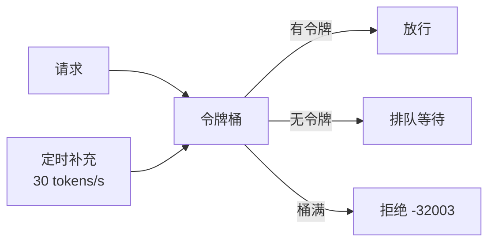

| 参数 | 默认值 | 说明 |
|------|--------|------|
| 令牌桶容量 | 30 | 最大突发请求数 |
| 补充速率 | 30/s | 每秒补充令牌数 |
| 排队超时 | 5s | 超时后拒绝 |
| 批处理窗口 | 50ms | 合并窗口时间 |

## 与原版 funplay-godot-mcp 的对比

### 架构对比

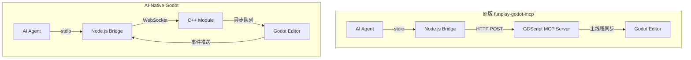

### 功能对比

| 维度 | funplay-godot-mcp | AI-Native Godot |
|------|-------------------|-----------------|
| **实现层级** | GDScript 插件 | C++ Module |
| **安装方式** | 每个项目手动安装 | 编译即内置 |
| **通信协议** | HTTP 单向 | WebSocket 双向 |
| **执行模型** | 主线程同步 | 命令队列异步 |
| **崩溃恢复** | ❌ 无 | ✅ 沙箱隔离 + 自动回滚 |
| **批量操作** | ❌ 不支持 | ✅ 批处理合并 |
| **限流** | ❌ 无 | ✅ 令牌桶 |
| **事件推送** | ❌ 无 | ✅ 实时事件流 |
| **增量同步** | ❌ 无 | ✅ 版本化增量快照 |
| **多客户端** | ❌ 单连接 | ✅ 最多 5 连接 |
| **断线重连** | ❌ | ✅ 指数退避重连 |
| **原子事务** | ❌ | ✅ 原子组 + 级联回滚 |
| **性能** | GDScript 开销 | C++ 原生 50-100x |
| **安全性** | 无保护 | 多层保护（沙箱+限流+超时） |
| **工具数量** | 70+ | 100+（兼容 + 增强） |

### 兼容性

AI-Native Godot 的 MCP 工具 API **向后兼容** funplay-godot-mcp：

- 所有原版工具名称和参数格式完全保留
- 新增工具使用独立命名空间前缀避免冲突
- 返回值格式在原版基础上扩展（新增字段，不删除）
