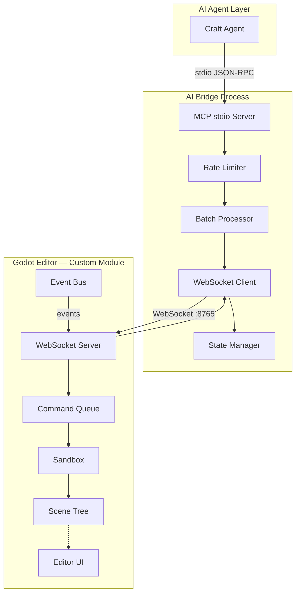

# AI-Native Godot

> 为 AI Agent 优化的 Godot 游戏引擎，让 AI 直接参与游戏开发的全流程。

## 项目介绍

AI-Native Godot 是在 Godot 引擎基础上深度定制的 AI-Native 版本。它不是通过 GDScript 插件来桥接 AI，而是将 MCP（Model Context Protocol）支持作为 **C++ Module** 内建到引擎核心，从根本上解决原版方案在稳定性、性能和实时性上的瓶颈。

### 它解决什么问题？

| 问题 | 原版方案（GDScript 插件） | AI-Native Godot |
|------|--------------------------|-----------------|
| AI 操作导致编辑器崩溃 | 无恢复手段 | 沙箱隔离 + 自动回滚 |
| 批量操作性能差 | 主线程同步阻塞 | 命令队列 + 批处理合并 |
| 无法实时获取编辑器状态 | 无事件推送 | WebSocket 双向通信 + 实时事件流 |
| 请求过载 | 无限流 | 令牌桶限流 |
| 通信协议 | HTTP 单向请求 | WebSocket 双向实时通信 |
| 实现层级 | GDScript 插件（需逐项目安装） | C++ Module（编译即内置） |

## 架构概览



## 快速开始

### 1. 编译 AI-Native Godot

```bash
# 克隆项目
git clone https://github.com/your-org/godot-ai-native.git
cd godot-ai-native

# 编译（详见 docs/BUILD.md）
scons platform=windows target=editor
```

### 2. 启动 AI Bridge

```bash
cd ai-bridge
npm install
npm run build
node bin/godot-ai-bridge.js
```

### 3. 启动编辑器

```bash
./bin/godot.editor.windows.x86_64
```

编辑器启动后，MCP Editor 模块自动启动 WebSocket Server（默认端口 8765）。

### 4. 连接 Craft Agent

在 Craft Agent 中添加 `godot-ai-native` source，配置见 [craft-source/](../craft-source/)。

## 目录结构

```
godot-ai-native/
├── ai-bridge/              # AI Bridge 进程（Node.js MCP stdio server）
│   ├── bin/                # 编译输出
│   ├── src/                # TypeScript 源码
│   ├── package.json
│   └── tsconfig.json
├── module/                 # Godot C++ Module（MCP Editor 模块）
│   ├── core/               # 核心组件
│   │   ├── mcp_command_queue.h/cpp
│   │   ├── mcp_sandbox.h/cpp
│   │   ├── mcp_event_bus.h/cpp
│   │   ├── mcp_websocket_server.h/cpp
│   │   └── mcp_snapshot.h/cpp
│   ├── tools/              # 工具分派层
│   │   └── tool_dispatcher.h/cpp
│   └── build/              # 构建配置
├── reference/              # 原版 funplay-godot-mcp 参考实现
│   ├── funplay_tool_registry.gd
│   ├── funplay_core_tools.gd
│   ├── funplay_mcp_server.gd
│   ├── funplay_mcp_request_handler.gd
│   ├── funplay_http_transport.gd
│   ├── funplay-godot-mcp.js
│   └── plugin.gd
├── scripts/                # 辅助脚本
├── docs/                   # 文档
│   ├── README.md
│   ├── ARCHITECTURE.md
│   ├── BUILD.md
│   ├── MCP-TOOLS.md
│   ├── CONTRIBUTING.md
│   └── CHANGELOG.md
└── craft-source/           # Craft Agent Source 配置
    ├── config.json
    └── guide.md
```

## 与原版 Godot 的区别

AI-Native Godot 基于 Godot 源码进行修改，主要变更：

1. **新增 MCP Editor Module** — 作为引擎内置 C++ 模块，无需安装插件
2. **WebSocket Server 内建** — 替代 HTTP 传输层，支持双向实时通信
3. **命令队列系统** — 所有操作异步化，不阻塞主线程
4. **沙箱隔离** — 每个命令在隔离环境中执行，失败自动回滚
5. **事件总线** — 编辑器状态变化实时推送给 AI
6. **状态快照** — 支持增量同步，大幅降低通信开销

其余 Godot 功能完全兼容，不影响正常游戏开发工作流。

## 编译和安装

详见 [BUILD.md](./BUILD.md)。

### 环境要求

| 依赖 | 最低版本 | 说明 |
|------|---------|------|
| Python | 3.6+ | SCons 构建系统 |
| SCons | 4.0+ | Godot 构建工具 |
| C++ 编译器 | — | MSVC 2022 / GCC 12+ / Clang 15+ |
| Node.js | 18+ | AI Bridge 进程 |

### 快速编译

```bash
# Windows
scons platform=windows target=editor

# Linux
scons platform=linuxbsd target=editor

# macOS
scons platform=macos target=editor
```

## 配置说明

### Godot 编辑器配置

MCP Editor 模块的配置通过 `editor_settings` 管理：

| 配置项 | 默认值 | 说明 |
|--------|--------|------|
| `mcp/server_enabled` | `true` | 是否自动启动 MCP Server |
| `mcp/websocket_port` | `8765` | WebSocket 监听端口 |
| `mcp/max_connections` | `5` | 最大客户端连接数 |
| `mcp/sandbox_enabled` | `true` | 是否启用沙箱隔离 |
| `mcp/sandbox_timeout_ms` | `5000` | 沙箱命令超时时间 |
| `mcp/event_bus_enabled` | `true` | 是否启用事件推送 |
| `mcp/snapshot_interval_ms` | `1000` | 状态快照间隔 |

### AI Bridge 环境变量

| 变量 | 默认值 | 说明 |
|------|--------|------|
| `GODOT_MCP_URL` | `ws://127.0.0.1:8765` | Godot MCP WebSocket 地址 |
| `MCP_RATE_LIMIT` | `30` | 每秒最大请求数 |
| `MCP_BATCH_SIZE` | `10` | 批处理最大合并数 |

## 文档索引

| 文档 | 说明 |
|------|------|
| [ARCHITECTURE.md](./ARCHITECTURE.md) | 详细架构设计文档 |
| [BUILD.md](./BUILD.md) | 编译指南 |
| [MCP-TOOLS.md](./MCP-TOOLS.md) | MCP 工具完整参考 |
| [CONTRIBUTING.md](./CONTRIBUTING.md) | 贡献指南 |
| [CHANGELOG.md](./CHANGELOG.md) | 变更日志 |

## 许可证

MIT License
